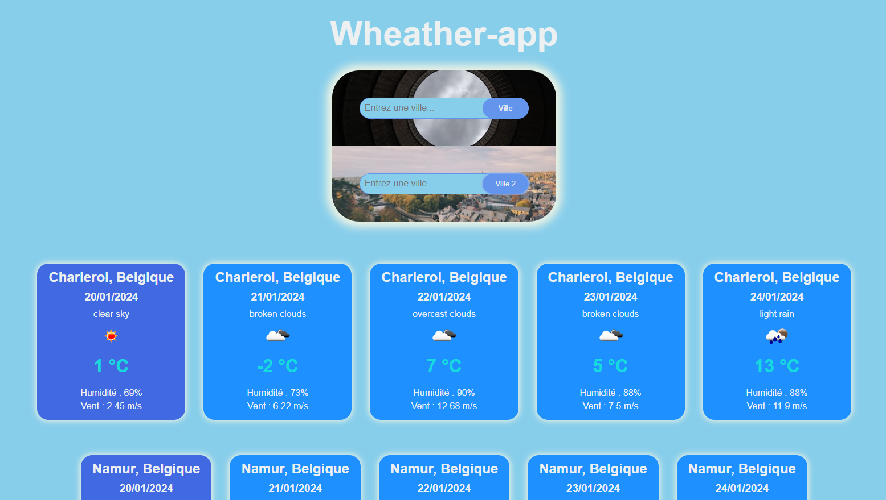
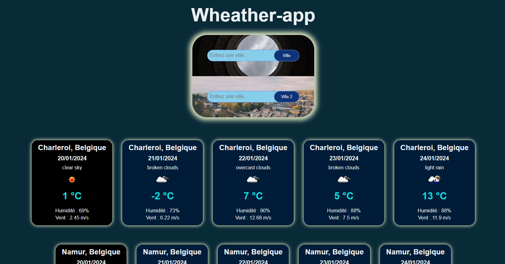
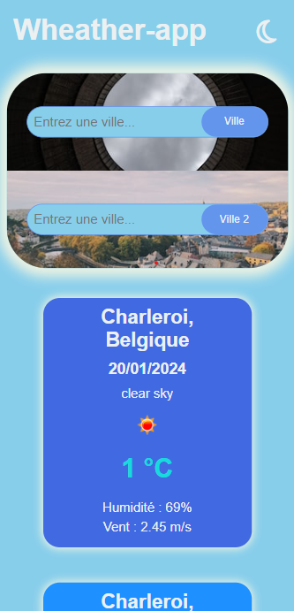
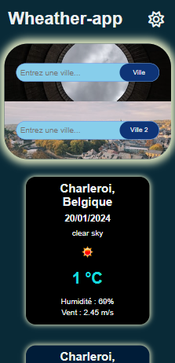

# Weather-app

Le projet Weather App est une application web qui permet aux utilisateurs de consulter les prévisions météorologiques pour différentes villes, tout en offrant la possibilité de comparer la météo pour deux d'entre elles. Les principales fonctionnalités comprennent la recherche de villes, l'affichage des prévisions sur 5 jours, la mémorisation des dernières villes consultées ainsi qu'un mode sombre.

## Fonctionnalités

- **Recherche de Villes :** Permet aux utilisateurs de rechercher des informations météorologiques pour une ville spécifique.

- **Comparaison de Météo :** Offre la possibilité de comparer les prévisions météorologiques pour deux villes différentes.

- **Affichage sur 5 Jours :** Présente les prévisions météorologiques détaillées pour les cinq prochains jours.

- **Stockage Local :** Les données des villes précédemment consultées sont sauvegardées localement pour un accès rapide lorsqu'ils cliquent dans la barre de recherche des villes.

- **Mode Sombre :** Inclut un mode sombre pour une expérience utilisateur personnalisée. Le choix du mode sombre est également mémorisé pour sa prochaine visite.

- **Affichage Photo :** Lorsqu'une ville est choisie, l'utilisateur a un petit aperçu de la ville grâce à une photo s'affichant derrière la barre de recherche.

## Installation

1. Accédez à l'application Weather-app en utilisant le lien suivant : [Weather-app sur GitHub Pages](https://ecila83.github.io/weather-app/).

2. Vous êtes prêt à explorer les prévisions météorologiques de différentes villes et à profiter des fonctionnalités de l'application Weather-app en ligne !

## Comment Utiliser

1. Entrez le nom de la ville dans le champ de recherche.
2. Sélectionnez la ville souhaitée dans la liste déroulante.
3. Consultez les prévisions météorologiques affichées.
4. Pour comparer la météo avec une autre ville, entrez un deuxième endroit dans le champ dédié.

## Captures d'Écran

## Technologies Utilisées

- HTML, SASS/CSS, JavaScript
- API OpenWeatherMap pour les données météorologiques
- API Unsplash pour les images de fond en fonction de la ville
- API OpenStreetMap (Nominatim) pour le nom des villes et l'autocomplétion
- JSON pour la gestion des données et le stockage dans le Local Storage
